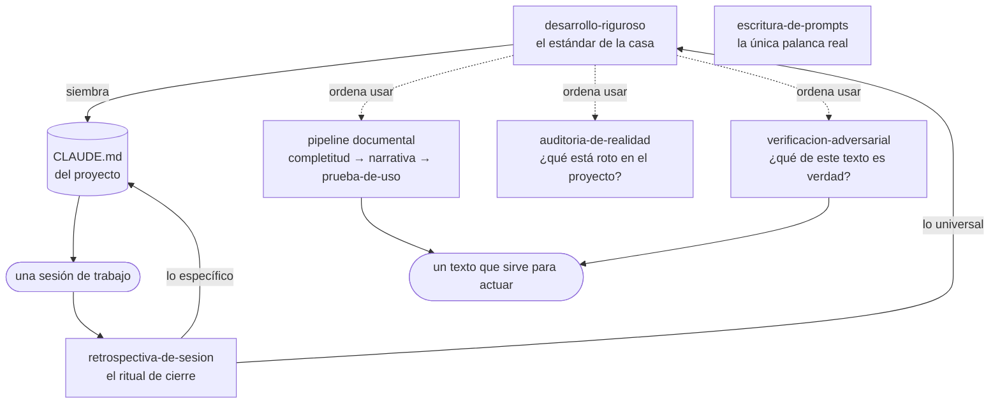
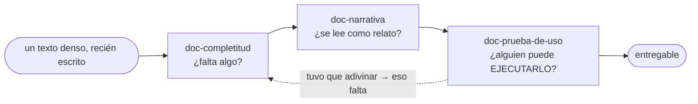
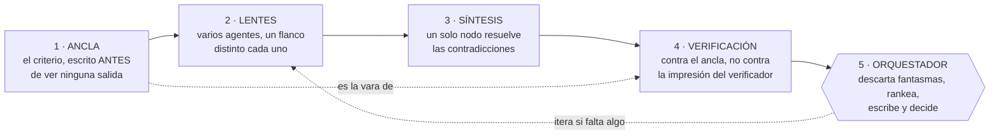

# Kumo Skills

Biblioteca canónica de **Agent Skills** de Kumo para Claude.

Las skills extienden las capacidades de Claude con conocimiento de dominio: workflows, contexto, plantillas, mejores prácticas. Cuando Claude detecta que una skill aplica a la tarea que le pediste, la carga automáticamente y la aplica. Acá viven las que usa Kumo, versionadas en git.

Para detalles de gobernanza interna (cómo agregar una skill, convenciones de naming, checklist de review antes de mergear), ver [CLAUDE.md](CLAUDE.md).

## Skills disponibles

| Skill | Qué hace |
|---|---|
| [`desarrollo-riguroso`](desarrollo-riguroso/) | El estándar de desarrollo de Kumo para cualquier proyecto: TDD, verificación contra datos reales, prevención sistémica de bugs, observabilidad y honestidad. Se siembra en el `CLAUDE.md` de cada proyecto. |
| [`retrospectiva-de-sesion`](retrospectiva-de-sesion/) | Ritual de cierre de una sesión de código: destila las correcciones en aprendizajes y los compone en el `CLAUDE.md` del proyecto (lo específico) y en `desarrollo-riguroso` (lo universal). |
| [`escritura-de-prompts`](escritura-de-prompts/) | Metodología para escribir, mejorar, auditar o diagnosticar prompts dirigidos a Claude. |
| [`doc-completitud`](doc-completitud/) | **Pipeline de calidad documental, paso 1** — endurece un texto hasta que un lector frío pueda explicar cada sección sin vacíos (que no falte nada). |
| [`doc-narrativa`](doc-narrativa/) | **Pipeline documental, paso 2** — reestructura un texto denso en un relato claro, sin perder contenido (que se lea bien). |
| [`doc-prueba-de-uso`](doc-prueba-de-uso/) | **Pipeline documental, paso 3** — valida que un lector frío débil pueda EJECUTAR la tarea que el texto habilita (que sirva para hacer, no solo para entender). |
| [`auditoria-de-realidad`](auditoria-de-realidad/) | Un agente fresco y escéptico hurga el estado REAL (repo, git, deploy, secretos, código) con pregunta abierta — caza lo que el propio aparato no está viendo. El complemento abierto de VERIFY-REAL. |
| [`verificacion-adversarial`](verificacion-adversarial/) | Aduana de hechos para un texto que se publica: buscadores reúnen evidencia y refutadores independientes intentan destruirla. El producto es un veredicto por afirmación, no un informe nuevo. |

### El mapa — por qué existe cada skill

Las ocho responden cuatro preguntas distintas. Cada nombre dice su propósito, no su mecanismo.

- **Cómo desarrollamos, y cómo mejora ese cómo.** `desarrollo-riguroso` es la constitución de ingeniería de Kumo — siembra el `CLAUDE.md` de cualquier proyecto nuevo; `retrospectiva-de-sesion` es cómo se enmienda — convierte cada sesión de código en aprendizaje durable (lo específico va al proyecto, lo universal al estándar).
- **Cómo hacemos que un texto sirva.** El pipeline de calidad documental (detalle abajo): `doc-completitud` → `doc-narrativa` → `doc-prueba-de-uso`. Existe porque un documento puede estar completo, leerse bien, y aun así ser inútil para actuar.
- **Cómo le hablamos al modelo.** `escritura-de-prompts` — el modelo está fijo; el prompt es la única palanca real, así que el prompting se vuelve método.
- **Cómo confrontamos la realidad.** `auditoria-de-realidad` (sobre un proyecto: repo, deploy, secretos) y `verificacion-adversarial` (sobre un texto que se publica: cifras, citas, afirmaciones). Existen porque todo nuestro propio aparato de validación comparte nuestros puntos ciegos; solo un contexto sin nuestro contexto encuentra lo que no sabíamos buscar.



El lazo del centro es lo único que hay que entender el primer día: **el estándar siembra el proyecto, el proyecto produce sesiones, y cada sesión devuelve aprendizaje al estándar.** Lo demás son herramientas que el estándar manda usar en momentos concretos.

### Pipeline de calidad documental — los textos también se testean

No solo el código se testea; un `CLAUDE.md`, una skill o un spec pueden "leerse bien" y ser inútiles — *un artefacto que pasa un control de coherencia todavía puede fallar en su propósito*. Kumo endurece cualquier texto de valor con tres skills **en orden**:

**`doc-completitud`** (que no falte nada) → **`doc-narrativa`** (que se lea como relato) → **`doc-prueba-de-uso`** (que un lector frío pueda ejecutar la tarea que el texto habilita).

La prueba de uso es a la prosa lo que un test de integración es al código: **explicar ≠ poder hacer**. Se aplican a cualquier documento para cualquier fin — desde un anexo técnico hasta las skills de este mismo repo.



Cada paso es más exigente que el anterior, y el orden importa: no sirve pulir el relato de un texto al que le faltan datos.

## Cómo funcionan por dentro — el esqueleto compartido

Cinco de las ocho skills (`doc-completitud`, `doc-narrativa`, `doc-prueba-de-uso`, `auditoria-de-realidad`, `verificacion-adversarial`) **no son una lista de pasos: son un grafo de agentes**, y es el mismo grafo en las cinco. Entender este diagrama una vez es entender las cinco.



Por qué esa forma y no otra: el **ancla** existe porque un verificador sin criterio previo confirma alegremente lo que la primera fase dejó fuera. Las **lentes** son distintas entre sí porque tres agentes idénticos repiten el mismo punto ciego. La **síntesis** es un solo nodo porque varias lentes escribiendo sobre el mismo objeto se pisan. Y el **orquestador** nunca delega la decisión final: es el único que tiene el contexto completo, y los agentes también alucinan.

Qué enchufa cada skill en cada nodo:

| Skill | Su ancla | Sus lentes | Qué decide el orquestador |
|---|---|---|---|
| `doc-completitud` | el documento mismo | lectores ciegos que marcan vacíos | qué vacío parchar y cómo |
| `doc-narrativa` | inventario del contenido original | editores de narrativa, densidad y estructura | el plan de redacción final |
| `doc-prueba-de-uso` | un rubric escrito antes de ver salidas | lectores débiles que EJECUTAN la tarea | qué falta concretar en el texto |
| `auditoria-de-realidad` | los artefactos reales (repo, git, deploy) | un escéptico fresco por superficie de riesgo | qué hallazgo es real y qué se cierra primero |
| `verificacion-adversarial` | las afirmaciones del texto y sus fuentes | refutadores por fuente, medición e inferencia | qué se imprime y qué no |

El esqueleto completo —con los modos de fallo que cada skill pagó por separado— vive en [`desarrollo-riguroso/reference/esqueleto-de-verificacion.md`](desarrollo-riguroso/reference/esqueleto-de-verificacion.md). Las otras tres skills (`desarrollo-riguroso`, `retrospectiva-de-sesion`, `escritura-de-prompts`) no son grafos: son método que se aplica leyéndolo.

## Instalación

Las skills se instalan **distinto en cada superficie de Claude**, y no se sincronizan automáticamente entre ellas. Si usas Claude en varios lugares, hay que instalar en cada uno.

### Claude Code

Las skills viven en el filesystem como carpetas. Claude Code las descubre automáticamente al iniciar una sesión.

**Instalación personal** (disponible en todos tus proyectos):

```bash
git clone https://github.com/JoaquinMulet/kumo-skills.git
cp -r kumo-skills/escritura-de-prompts ~/.claude/skills/
```

**Instalación a nivel proyecto** (compartida con quien clone ese repo):

```bash
cp -r kumo-skills/escritura-de-prompts /ruta/al/proyecto/.claude/skills/
```

En Windows con PowerShell:

```powershell
git clone https://github.com/JoaquinMulet/kumo-skills.git
Copy-Item -Recurse kumo-skills/escritura-de-prompts $HOME/.claude/skills/
```

Si la carpeta `~/.claude/skills/` no existe, créala antes. Reiniciar la sesión de Claude Code para que la nueva skill aparezca.

### claude.ai (Pro / Max / Team / Enterprise)

Requiere code execution habilitado en tu cuenta.

1. Descarga la carpeta de la skill desde GitHub (por ejemplo `escritura-de-prompts/`).
2. Comprímela en un archivo `.zip`.
3. En claude.ai: **Settings → Features → Skills → Upload**.

Las skills en claude.ai son **por usuario**: cada miembro del equipo las sube a su propia cuenta. No hay distribución central org-wide.

### Claude API

Las skills se suben con el endpoint `POST /v1/skills`. Requiere tres headers beta:

- `code-execution-2025-08-25`
- `skills-2025-10-02`
- `files-api-2025-04-14`

Una vez subida, referencia el `skill_id` retornado en el parámetro `container` de tu request, junto al tool de code execution. Detalles y ejemplos en la [documentación oficial de Anthropic](https://docs.claude.com/en/build-with-claude/skills-guide).

Las skills subidas vía API son **workspace-wide**: todos los miembros del workspace pueden usarlas.

## Cómo se invocan

Una vez instalada, no hay que invocar la skill explícitamente. Pídele a Claude la tarea en lenguaje natural y, si la `description` de la skill calza con la petición, Claude la usa solo. Por ejemplo, con `escritura-de-prompts` instalada basta con:

> "Ayúdame a escribir un prompt para hacer X."
>
> "Revísame este prompt antes de usarlo en producción."
>
> "¿Por qué Claude me respondió esto y no lo que yo quería?"

## Contribuir

Antes de proponer una skill nueva o modificar una existente, leer [CLAUDE.md](CLAUDE.md). Cubre estructura mínima de una skill, convenciones de Kumo (naming, idioma, descriptions efectivas), cuándo vale la pena hacer skill vs solo prompt, y el checklist de review obligatorio antes de mergear cualquier PR.

## Licencia

[MIT](LICENSE).
