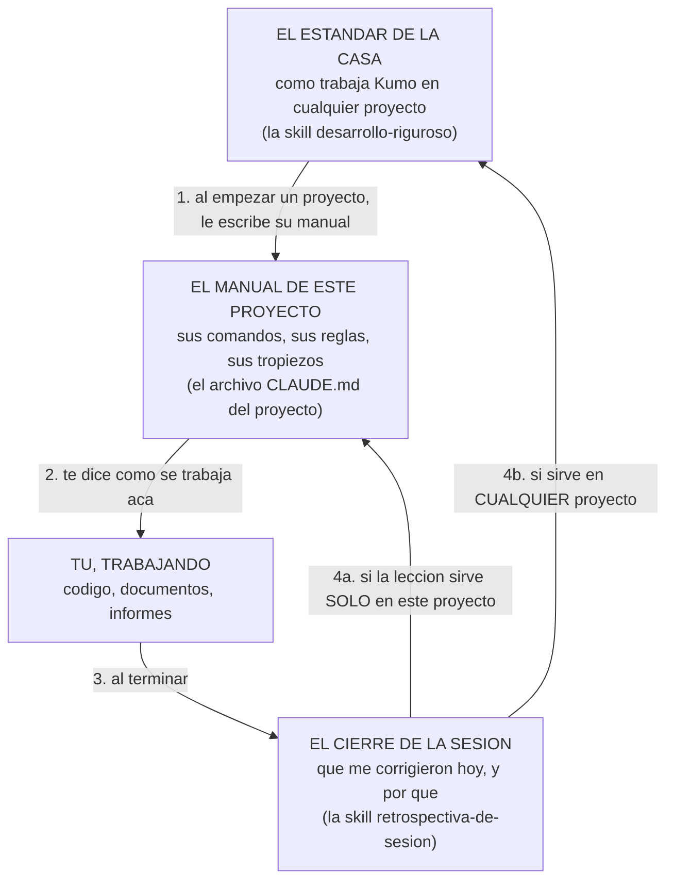
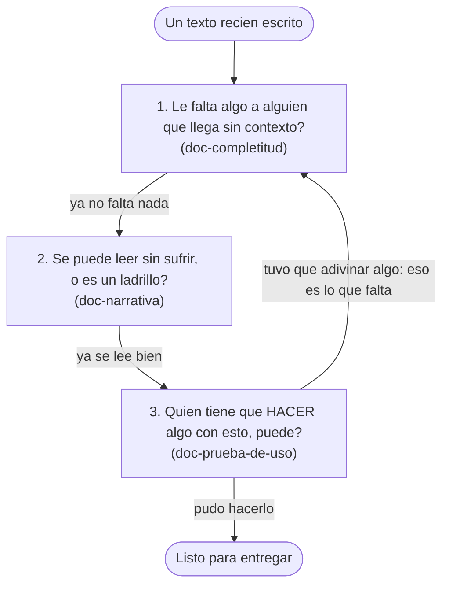
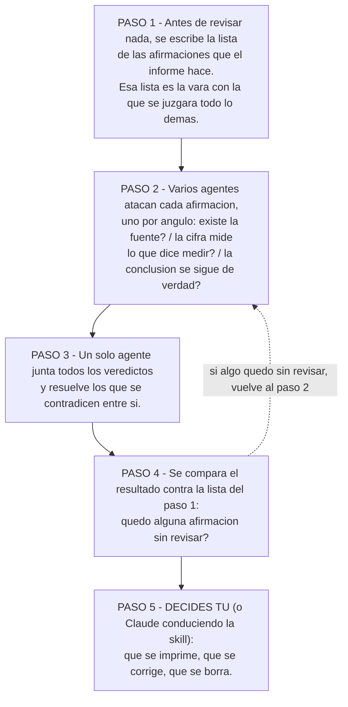

# Kumo Skills

Biblioteca canónica de **Agent Skills** de Kumo para Claude.

Las skills extienden las capacidades de Claude con conocimiento de dominio: workflows, contexto, plantillas, mejores prácticas. Cuando Claude detecta que una skill aplica a la tarea que le pediste, la carga automáticamente y la aplica. Acá viven las que usa Kumo, versionadas en git.

Para detalles de gobernanza interna (cómo agregar una skill, convenciones de naming, checklist de review antes de mergear), ver [CLAUDE.md](CLAUDE.md).

## Skills disponibles

| Skill | Qué hace |
|---|---|
| [`desarrollo-riguroso`](desarrollo-riguroso/) | El estándar de desarrollo de Kumo para cualquier proyecto: TDD, verificación contra datos reales, prevención sistémica de bugs, observabilidad y honestidad. Se siembra en el `CLAUDE.md` de cada proyecto. |
| [`retrospectiva-de-sesion`](retrospectiva-de-sesion/) | Ritual de cierre de una sesión de código: destila las correcciones en aprendizajes y los compone en el `CLAUDE.md` del proyecto (lo específico) y en `desarrollo-riguroso` (lo universal). |
| [`escritura-de-prompts`](escritura-de-prompts/) | Metodología para escribir, mejorar, auditar o diagnosticar prompts dirigidos a Claude. |
| [`doc-completitud`](doc-completitud/) | **Pipeline de calidad documental, paso 1** — endurece un texto hasta que un lector frío pueda explicar cada sección sin vacíos (que no falte nada). |
| [`doc-narrativa`](doc-narrativa/) | **Pipeline documental, paso 2** — reestructura un texto denso en un relato claro, sin perder contenido (que se lea bien). |
| [`doc-prueba-de-uso`](doc-prueba-de-uso/) | **Pipeline documental, paso 3** — valida que un lector frío débil pueda EJECUTAR la tarea que el texto habilita (que sirva para hacer, no solo para entender). |
| [`auditoria-de-realidad`](auditoria-de-realidad/) | Un agente fresco y escéptico hurga el estado REAL (repo, git, deploy, secretos, código) con pregunta abierta — caza lo que el propio aparato no está viendo. El complemento abierto de VERIFY-REAL. |
| [`verificacion-adversarial`](verificacion-adversarial/) | Aduana de hechos para un texto que se publica: buscadores reúnen evidencia y refutadores independientes intentan destruirla. El producto es un veredicto por afirmación, no un informe nuevo. |

### El mapa — por qué existe cada skill

Las ocho responden cuatro preguntas distintas. Cada nombre dice su propósito, no su mecanismo.

- **Cómo desarrollamos, y cómo mejora ese cómo.** `desarrollo-riguroso` es la constitución de ingeniería de Kumo — siembra el `CLAUDE.md` de cualquier proyecto nuevo; `retrospectiva-de-sesion` es cómo se enmienda — convierte cada sesión de código en aprendizaje durable (lo específico va al proyecto, lo universal al estándar).
- **Cómo hacemos que un texto sirva.** El pipeline de calidad documental (detalle abajo): `doc-completitud` → `doc-narrativa` → `doc-prueba-de-uso`. Existe porque un documento puede estar completo, leerse bien, y aun así ser inútil para actuar.
- **Cómo le hablamos al modelo.** `escritura-de-prompts` — el modelo está fijo; el prompt es la única palanca real, así que el prompting se vuelve método.
- **Cómo confrontamos la realidad.** `auditoria-de-realidad` (sobre un proyecto: repo, deploy, secretos) y `verificacion-adversarial` (sobre un texto que se publica: cifras, citas, afirmaciones). Existen porque todo nuestro propio aparato de validación comparte nuestros puntos ciegos; solo un contexto sin nuestro contexto encuentra lo que no sabíamos buscar.

### El ciclo — lo único que hay que entender el primer día

Kumo no guarda su experiencia en la cabeza de nadie: la guarda en dos archivos que se
alimentan entre sí. **El estándar de la casa** dice cómo se trabaja en cualquier proyecto. **El
manual de un proyecto** dice cómo se trabaja en ese proyecto en particular. Cada vez que
cierras una sesión de trabajo, lo que aprendiste se reparte entre esos dos según a quién le
sirva. Sigue las flechas numeradas:



En una frase: **el estándar escribe el manual del proyecto, el manual guía el trabajo, y el
cierre de cada sesión devuelve lo aprendido a uno de los dos.** Por eso el próximo proyecto de
Kumo arranca sabiendo lo que este aprendió a los golpes, sin que nadie tenga que acordarse.

Quién hace cada flecha, en concreto: las cuatro las ejecuta **Claude**, no un humano con una
plantilla. En el paso 1 le pides empezar un proyecto, Claude carga la skill `desarrollo-riguroso`
y escribe el `CLAUDE.md` de ese proyecto siguiendo
[la plantilla del repo](desarrollo-riguroso/reference/plantilla-claude-md.md) — comandos exactos
del stack, reglas del dominio, y una sección de lecciones que arranca casi vacía. En el paso 3
le pides cerrar la sesión y Claude carga `retrospectiva-de-sesion`, que es la que reparte. Tú
apruebas y corriges; el trabajo mecánico no es tuyo.

### Las otras cinco — herramientas para momentos concretos del paso 3

No son parte del ciclo: son las que se invocan **mientras trabajas**, cuando aparece una de
estas cinco situaciones.

| Cuando te pasa esto… | …se usa esta skill |
|---|---|
| Escribiste un documento y no sabes si a otro le va a faltar contexto | [`doc-completitud`](doc-completitud/) |
| El documento no le falta nada, pero es un muro de tablas y listas que cuesta leer | [`doc-narrativa`](doc-narrativa/) |
| El documento se lee bien, pero quien tiene que **hacer algo** con él no puede | [`doc-prueba-de-uso`](doc-prueba-de-uso/) |
| Un informe con cifras se va a enviar a un cliente y no quieres publicar un dato falso | [`verificacion-adversarial`](verificacion-adversarial/) |
| Heredaste un proyecto, o sospechas que hay algo grave que nadie está viendo | [`auditoria-de-realidad`](auditoria-de-realidad/) |
| Le pediste algo a Claude y te respondió cualquier cosa | [`escritura-de-prompts`](escritura-de-prompts/) |

### Pipeline de calidad documental — los textos también se testean

No solo el código se testea; un `CLAUDE.md`, una skill o un spec pueden "leerse bien" y ser inútiles — *un artefacto que pasa un control de coherencia todavía puede fallar en su propósito*. Kumo endurece cualquier texto de valor con tres skills **en orden**:

**`doc-completitud`** (que no falte nada) → **`doc-narrativa`** (que se lea como relato) → **`doc-prueba-de-uso`** (que un lector frío pueda ejecutar la tarea que el texto habilita).

La prueba de uso es a la prosa lo que un test de integración es al código: **explicar ≠ poder hacer**. Se aplican a cualquier documento para cualquier fin — desde un anexo técnico hasta las skills de este mismo repo.

Las tres hacen la misma pregunta con una vara cada vez más alta. Cada caja es una pregunta que
el texto tiene que aprobar antes de pasar a la siguiente:



El orden importa y no es negociable: no sirve pulir la redacción de un texto al que todavía le
faltan datos. Y la tercera pregunta es la que sorprende — un documento puede estar completo y
bien escrito, y aun así quien debe construir algo con él no puede. **Explicar no es lo mismo
que habilitar.**

Dos aclaraciones sobre el dibujo: **se pueden usar por separado** (si tu texto ya está completo
y solo es denso, corres la 2 sola), pero cuando se usan juntas van en ese orden. Y la flecha de
vuelta **solo se recorre si la pregunta 3 falla**: lo que el lector tuvo que adivinar es
exactamente lo que faltaba, así que se rellena y se vuelve a bajar. Si nadie tuvo que adivinar,
el texto sale por la derecha y no hay loop.

## Cómo funcionan por dentro — las cinco hacen lo mismo

Cinco de las ocho skills no le piden a Claude que revise algo él solo: **lanzan varios agentes
en paralelo**, cada uno mirando el mismo material desde un ángulo distinto, y después alguien
junta los resultados. Las cinco siguen exactamente la misma secuencia de cinco pasos.

Para verla, un caso real de una de ellas: un informe con cifras que se va a enviar a un cliente.



Las tres decisiones de diseño que explican por qué es así, y no de otra forma:

- **La lista del paso 1 se escribe ANTES**, nunca después. Un revisor que no sabe qué buscar
  aprueba felizmente lo que la primera fase dejó afuera: confirma lo que hay, no detecta lo que
  falta.
- **Los agentes del paso 2 son distintos entre sí**, no copias. Tres agentes con la misma
  instrucción repiten el mismo punto ciego tres veces y eso se siente como triple confirmación.
- **La decisión del paso 5 no se delega nunca.** Los agentes también inventan cosas, y solo
  quien conduce tiene el contexto para saber cuál hallazgo es real. El grafo entrega un informe
  etiquetado, jamás un cambio ya aplicado.

Sobre ese paso 5: **quien decide es Claude conduciendo la skill** — el que lanzó los agentes y
tiene el documento completo a la vista, no uno de los agentes lanzados. Antes de aplicar un
cambio va a buscar el hallazgo en el archivo real para descartar los inventados, y te muestra lo
grave para que decidas tú. La regla de la casa es que ningún agente suelto escribe el resultado
final.

Dentro del repo esos cinco pasos se llaman **ancla → lentes → síntesis → verificación →
decisión del orquestador**; los vas a ver con esos nombres en el código de las skills. Y esto es
lo que cada una pone en cada paso:

| Skill | Su lista del paso 1 (la vara) | Sus agentes del paso 2 | Lo que se decide al final |
|---|---|---|---|
| `verificacion-adversarial` | las afirmaciones del texto y sus fuentes | uno por ángulo: fuente, medición, inferencia | qué se imprime y qué no |
| `doc-completitud` | el documento mismo | lectores sin contexto que marcan qué no entienden | qué vacío se rellena y cómo |
| `doc-narrativa` | un inventario de todo lo que el texto ya dice | editores de narrativa, densidad y estructura | el plan de reescritura |
| `doc-prueba-de-uso` | una pauta de corrección escrita antes de ver nada | lectores que intentan HACER la tarea del documento | qué hay que concretar en el texto |
| `auditoria-de-realidad` | los archivos reales del proyecto (repo, git, deploy) | un escéptico por cada zona de riesgo | qué hallazgo es real y qué se arregla primero |

Las otras tres (`desarrollo-riguroso`, `retrospectiva-de-sesion`, `escritura-de-prompts`) no
lanzan agentes: son método que Claude aplica leyéndolas. Y eso es literal — no hay que invocarlas
a mano: al iniciar la sesión Claude lee el nombre y la descripción de cada skill instalada, y
cuando le pides algo que calza con una, la carga completa y la sigue (ver
[Cómo se invocan](#cómo-se-invocan) más abajo). El detalle técnico de la maquinaria
—incluidos los errores que cada skill pagó por separado— vive en
[`desarrollo-riguroso/reference/esqueleto-de-verificacion.md`](desarrollo-riguroso/reference/esqueleto-de-verificacion.md).

## Instalación

Las skills se instalan **distinto en cada superficie de Claude**, y no se sincronizan automáticamente entre ellas. Si usas Claude en varios lugares, hay que instalar en cada uno.

### Claude Code

Las skills viven en el filesystem como carpetas. Claude Code las descubre automáticamente al iniciar una sesión.

**Instalación personal** (disponible en todos tus proyectos):

```bash
git clone https://github.com/JoaquinMulet/kumo-skills.git
cp -r kumo-skills/escritura-de-prompts ~/.claude/skills/
```

**Instalación a nivel proyecto** (compartida con quien clone ese repo):

```bash
cp -r kumo-skills/escritura-de-prompts /ruta/al/proyecto/.claude/skills/
```

En Windows con PowerShell:

```powershell
git clone https://github.com/JoaquinMulet/kumo-skills.git
Copy-Item -Recurse kumo-skills/escritura-de-prompts $HOME/.claude/skills/
```

Si la carpeta `~/.claude/skills/` no existe, créala antes. Reiniciar la sesión de Claude Code para que la nueva skill aparezca.

**Cuál de las dos elegir.** La personal (`~/.claude/skills/`) vive en tu equipo: la ves tú en
todos tus proyectos y nadie más. La de proyecto (`<proyecto>/.claude/skills/`) se commitea junto
al código: la ve cualquiera que clone ese repo, y solo dentro de él. Regla práctica: las skills
transversales de Kumo van en la personal; una skill que solo tiene sentido en un proyecto
concreto va en la de ese proyecto.

### claude.ai (Pro / Max / Team / Enterprise)

Requiere code execution habilitado en tu cuenta.

1. Descarga la carpeta de la skill desde GitHub (por ejemplo `escritura-de-prompts/`).
2. Comprímela en un archivo `.zip`.
3. En claude.ai: **Settings → Features → Skills → Upload**.

Las skills en claude.ai son **por usuario**: cada miembro del equipo las sube a su propia cuenta. No hay distribución central org-wide.

### Claude API

Las skills se suben con el endpoint `POST /v1/skills`. Requiere tres headers beta:

- `code-execution-2025-08-25`
- `skills-2025-10-02`
- `files-api-2025-04-14`

Una vez subida, referencia el `skill_id` retornado en el parámetro `container` de tu request, junto al tool de code execution. Detalles y ejemplos en la [documentación oficial de Anthropic](https://docs.claude.com/en/build-with-claude/skills-guide).

Las skills subidas vía API son **workspace-wide**: todos los miembros del workspace pueden usarlas.

## Cómo se invocan

Una vez instalada, no hay que invocar la skill explícitamente. Pídele a Claude la tarea en lenguaje natural y, si la `description` de la skill calza con la petición, Claude la usa solo. Por ejemplo, con `escritura-de-prompts` instalada basta con:

> "Ayúdame a escribir un prompt para hacer X."
>
> "Revísame este prompt antes de usarlo en producción."
>
> "¿Por qué Claude me respondió esto y no lo que yo quería?"

## Contribuir

Antes de proponer una skill nueva o modificar una existente, leer [CLAUDE.md](CLAUDE.md). Cubre estructura mínima de una skill, convenciones de Kumo (naming, idioma, descriptions efectivas), cuándo vale la pena hacer skill vs solo prompt, y el checklist de review obligatorio antes de mergear cualquier PR.

## Licencia

[MIT](LICENSE).
